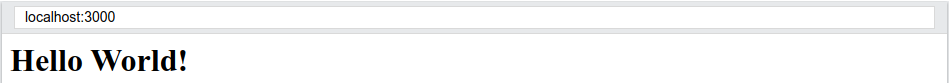
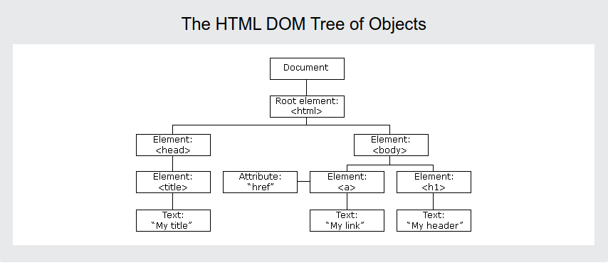

## Introduction
- React is a JavaScript library for building user interfaces.
- React is used to build single-page applications.
- React allows us to create reusable UI components.
- React, sometimes referred to as a frontend JavaScript framework, is a JavaScript library created by Facebook.

## Live example
```react
import React from "react";
import ReactDOM from "react-dom/client";

function Hello(props) {
  return <h1>Hello World!</h1>;
}

ReactDOM.render(<Hello />, document.getElementById("root"));
```


## Steps to run a react App
- Install latest npm & nodejs:
  - https://computingforgeeks.com/install-latest-node-js-and-npm-on-ubuntu-debian/
- Go to the terminal and run this commands:
    ```
        npx create-react-app my-app
        cd my-app
        npm start
    ```
- Reference: https://reactjs.org/docs/create-a-new-react-app.html

## How does React Work?
- **React creates a VIRTUAL DOM in memory**
  - Instead of manipulating the browser's DOM directly, React creates a virtual DOM in memory, where it does all the necessary manipulating, before making the changes in the browser DOM.

- **React only changes what needs to be changed!**
  - React finds out what changes have been made, and changes only what needs to be changed.

## What is DOM?
- A web page is a document that can be either displayed in the browser window or as the HTML source. 
- The Document Object Model (DOM) is a programming interface for web documents.
- It represents the page so that programs can change the document structure, style, and content. 
- As an object-oriented representation of the web page, it can be modified with a scripting language such as JavaScript.

## The HTML DOM (Document Object Model)
- When a web page is loaded, the browser creates a Document Object Model of the page.

- 
- With object model, JS gets all the power it needs to create dynamic HTML.
- JS can add, remove, modify HTML elements, attributes, CSS styles.
- For example: Modify html element `p` by the method `getElementById()`:
    ``` html
    <!DOCTYPE html>
    <html>
    <body>

    <h2>My First Page</h2>

    <p id="demo"></p>

    <script>
    document.getElementById("demo").innerHTML = "Hello World!";
    </script>

    </body>
    </html>
    ```
- **Output:**
  ```html
    My First Page
    Hello World!
  ```

## React.JS History
- Current version of React.JS is V18.2.0 (July 2022).
- Initial Release to the Public (V0.3.0) was in July 2013.
- React.JS was first used in 2011 for Facebook's Newsfeed feature.
- Facebook Software Engineer, Jordan Walke, created it.
- Current version of `create-react-app` is v5.0.1 (April 2022).
- `create-react-app` includes built tools such as webpack, Babel, and ESLint.


## React ES6 features
## Introduction to class
- ES6 introduced classes.
- A class is a type of function, but instead of using the keyword `function` to initiate it, we use the keyword `class`, and the properties are assigned inside a `constructor()` method.
- For example: Car class is starting with standard naming convention as uppercase
  ```javascript
  class Car {
  constructor(name) {
    this.brand = name;
  }
    }
  ```
- Creating an object called `mycar` based on the `Car` class:
  ``` javascript
    class Car {
     constructor(name) {
        this.brand = name;
        }
    }

    const mycar = new Car("Ford");
  ```

## Methods in Classes
We can add our own methods in a class
```javascript
    class Car {
        constructor(name) {
        this.brand = name;
    }
  
  present() {
    return 'I have a ' + this.brand;
  }
}

const mycar = new Car("Ford");
mycar.present();
```

## Class Inheritence
- To create a class, we can use the `extends` keyword. 
- As a example a class named `Model` which will inherit the methods from the `Car` class.
- The super() method refers to the parent class.
```javascript
class Car {
  constructor(name) {
    this.brand = name;
  }

  present() {
    return 'I have a ' + this.brand;
  }
}

class Model extends Car {
  constructor(name, mod) {
    super(name);
    this.model = mod;
  }  
  show() {
      return this.present() + ', it is a ' + this.model
  }
}
const mycar = new Model("Ford", "Mustang");
mycar.show();
```
**I will talk later about these topics**
## ES6 Arrow functions
## ES6 Variables
## ES6 Array methods
## ES6 Destructuring
## ES6 Spread Operator
## ES6 Modules
## ES6 Ternary operators 

## React Render HTML
- React's goal is in many ways to render HTML in a web page.
- React renders HTML to the web page by using a function called `ReactDOM.render()`.
- The `ReactDOM.render()` function takes two arguments, HTML code and HTML element
  